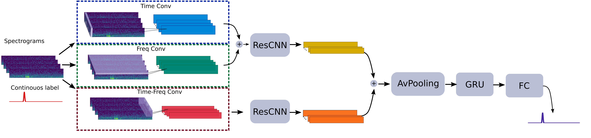

# Deep net detection and onset prediction of electrographic seizure patterns in responsive neurostimulation (iESPnet)
<p align="center">

</p>
You will find here all the codes and instructions needed to reproduce the experiments performed in "Deep net detection and onset prediction of electrographic seizure patterns in responsive neurostimulation", by Victoria Peterson, Vasileios Kokkinos, Enzo Ferrante, Ashley Walton, Amir Hadanny, Varun Saravanan, Nathaniel Sisterson, Naoir Zaher, Alexandra Urban and R. Mark Richardson.

## Installation guidelines
This guidelines are based on [Anaconda](https://www.anaconda.com/distribution/) distribution.
The library has been tested on Linux and Windows.

### Install requirements for reproducing the experiments
1. Download and extract the zip or clone [iESPnet]([https://github.com/vpeterson/otda-mibci.git](https://github.com/Brain-Modulation-Lab/Paper_iESPnet.git)
2. Go to the download directory
3. Create conda environment
```
conda env create -f environment.yml
```
4. Activate conda environment
```
conda activate iESPnet
```
5. Install [pytorch](https://pytorch.org/get-started/locally/) 
6. Check torch is installed. If Error (ImportError: DLL load failed: The operating system cannot run %1), run 
```
conda install -c defaults intel-openmp -f
```
7. Run the example

##### And you are ready. Happy coding!
